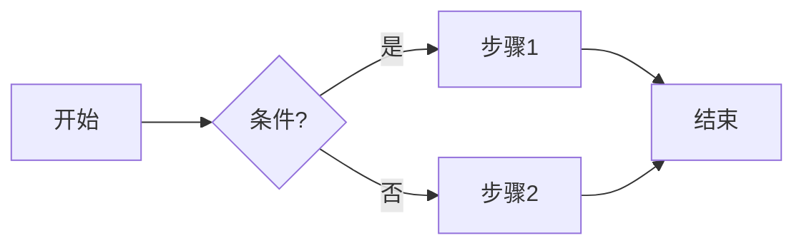
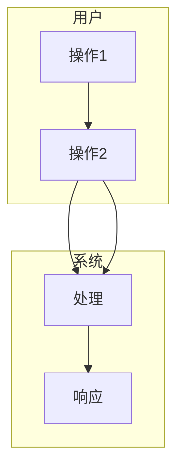
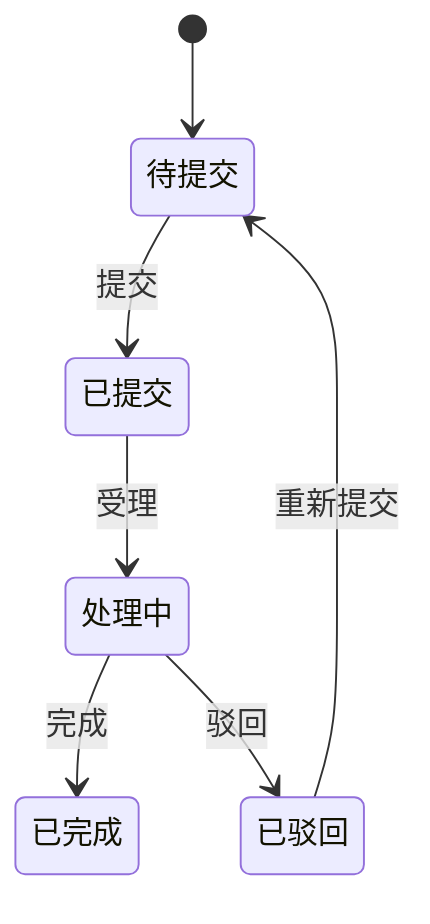
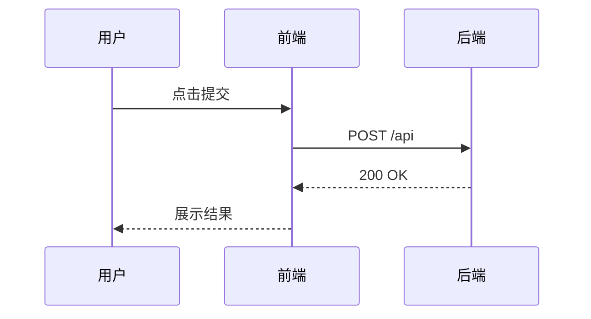

# Mermaid 使用规范与技巧（image-analysis 补充方法论）

> 本规范作为 **image-analysis** 技能的补充：在解析设计图/截图后，或当无图片需产出线框图、流程图、状态图、时序图等时，使用 **Mermaid** 在 Markdown 中生成可预览、可版本管理的图表，供需求、设计与前端实现使用。  
> 前置条件：已安装 **Mermaid**、**Markdown Preview Mermaid Support**；可参考外部教程如 [Mermaid Chart 插件解读（豆包）](https://www.doubao.com/thread/w69c7db7ca40d4abd)。

---

## 一、与 image-analysis 的衔接关系

| 场景 | 用法 |
|------|------|
| **有图** | image-analysis 解析图片 → 输出结构化描述；**补充**：根据解析结果用 Mermaid 产出**流程图、状态图、页面跳转图**等，写入 `docs/project-prd-changes/[change-id]/design-assets/flows/` 或对应 .md，与 PRD/设计产出物一起引用。 |
| **无图（产品经理侧）** | 按需求或 **PRD**（迭代需求说明/功能需求说明书）用 Mermaid 产出 **产品与交互向** 设计产出物，与 request-analysis REFERENCE「PRD 补充物」对应：**① 布局线框图**（flowchart 表示关键页/区块结构、分区与层级）→ `design-assets/wireframes/`；**② 交互链路设计图**（flowchart/stateDiagram 表示用户操作路径、状态流转、正常/异常分支）→ `design-assets/flows/`；**③ 功能界面要素示意**（可与 mockups 文档配合，用 flowchart/subgraph 表示首屏/CTA/设置面板等区域与组件关系）→ `design-assets/mockups/` 或 wireframes。在迭代需求说明或功能需求说明书对应小节引用，供**前端、后端、测试**按图实现与验收。 |
| **无图（架构侧）** | 按 **design.md** 或 **project-rules** 用 Mermaid 产出 **技术实现向** 图示，与 project-analysis REFERENCE「技术方案与架构产出物」对应：**① 技术架构图**（flowchart/subgraph 表示系统/模块/层次、边界与依赖）→ `docs/project-prd-changes/[change-id]/architecture/` 或 `project-rules/`；**② 执行逻辑图/流程图**（flowchart/stateDiagram 表示关键业务流程、状态机、决策分支）→ `architecture/` 或 flows 子目录；**③ 数据流图**（flowchart 表示数据在模块/服务间的流向与转换）→ 同上或 project-rules 下 data-flows；**④ 序列图/时序图**（sequenceDiagram 表示跨模块/服务调用顺序）→ 同上。在 design.md 或 project-rules 对应章节引用，供**前端/后端按图实现、code-review/func-test 对照**。 |

产出物路径约定：**产品经理侧**与 request-analysis REFERENCE「PRD 补充物」一致，为 `docs/project-prd-changes/[change-id]/design-assets/` 下 `wireframes/`、`flows/`、`mockups/`，并在迭代需求说明或功能需求说明书中引用；**架构侧**与 project-analysis REFERENCE 一致，为 `docs/project-prd-changes/[change-id]/architecture/` 或 `project-rules/`，并在 design.md 与 project-rules 中引用。

---

## 二、推荐图表类型与语法速查

| 类型 | Mermaid 类型 | 典型用途 | 关键字/示例 |
|------|----------------|----------|-------------|
| **流程图** | `flowchart` / `graph` | 操作步骤、分支、异常路径 | `flowchart LR` / `TD`；`A[节点] --> B{判断}`；`-->` / `-.->` / `==>` |
| **泳道图** | `flowchart` + `subgraph` | 多角色/多系统协同流程 | `subgraph 用户` … `end`；`subgraph 系统` … `end` |
| **状态图** | `stateDiagram-v2` | 状态机、页面/组件状态流转 | `state 状态名`；`[*] --> 状态`；`状态 --> 状态 : 事件` |
| **时序图** | `sequenceDiagram` | 前后端/模块间调用顺序 | `participant A`；`A->>B: 消息`；`alt`/`opt`/`loop` |
| **页面跳转** | `flowchart` | 页面/路由跳转关系 | 节点为页面名，边为跳转动作或链接 |
| **界面结构（线框）** | `flowchart TB` | 区块层级、上下布局 | 用 `subgraph` 表示区域，内为区块名或组件名 |

---

## 三、书写规范与技巧

### 3.1 通用规范

- **代码块**：所有 Mermaid 代码必须放在 Markdown 的 **\`\`\`mermaid** … **\`\`\`** 中，以便在 Cursor 中通过 Markdown Preview Mermaid Support 正确渲染。
- **单图复杂度**：单图节点数建议控制在 **15～20 以内**，过多时拆为多图（如「主流程」「异常分支」「数据流」分文件或分节）。
- **中文**：节点、边标签、subgraph 名称可使用中文，避免与 Mermaid 关键字冲突；若报错可尝试给中文加引号。
- **方向**：`flowchart LR`（左右）、`flowchart TD`（上下）、`flowchart TB`（自上而下）；交互流程常用 LR 或 TD，结构/层级常用 TB。

### 3.2 流程图（flowchart）

- **技巧**：`[ ]` 方框、`{ }` 菱形判断、`( )` 圆角、`|标签|` 为边上的说明；同一行多节点用 `-->` 连接；避免线条交叉过多，可适当用 `subgraph` 分组。

### 3.3 泳道（subgraph 模拟）

- **技巧**：用 `subgraph 角色/系统名` 划分泳道；跨泳道的边显式写出（如 `B --> C`），保证逻辑清晰。

### 3.4 状态图（stateDiagram-v2）

- **技巧**：`[*]` 表示起止；`状态 --> 状态 : 事件/动作`；同一状态的多条出边可分行写，便于阅读。

### 3.5 时序图（sequenceDiagram）

- **技巧**：`->>` 实线、`-->>` 虚线（返回）；`alt`/`opt`/`loop` 表示分支与循环；参与者尽量简短，可用 `as` 起别名。

### 3.6 与 OpenSpec / 设计产出物的对应

- **文件位置**：与 request-analysis、project-analysis 约定一致，Mermaid 图放在 **`docs/project-prd-changes/[change-id]/design-assets/flows/xxx.md`** 或 **wireframes/xxx.md**** 中，一文件可含多段 \`\`\`mermaid。
- **在 PRD 中引用**：在迭代需求说明或功能需求说明书对应小节写明「交互链路见 design-assets/flows/xxx.md」「线框结构见 wireframes/xxx.md」。
- **与解析结果的结合**：image-analysis 解析设计图后，可将「步骤、状态、参与方」抽成结构化列表，再按上表选择 Mermaid 类型生成对应图，并写入上述路径。

---

## 四、Cursor 中的使用流程（纯 AI 生成）

1. **由 AI 生成 Mermaid 代码**：在对话或 Composer 中说明需求（如「画登录流程的泳道图」「画订单状态图」），AI 在指定 .md 文件中写入 \`\`\`mermaid … \`\`\` 代码块。
2. **预览**：在 Cursor 中打开该 .md，使用 **Markdown 预览**（如右键 → Open Preview 或预览快捷键），确保已安装 **Markdown Preview Mermaid Support**，即可看到渲染后的图。
3. **修订**：直接修改 .md 中的 Mermaid 文本，保存后预览自动更新；或再次让 AI 根据反馈修改代码块。
4. **导出**（可选）：需 PNG/SVG 时，可使用 Mermaid CLI（`npx @mermaid-js/mermaid-cli`）或 Draw.io + Mermaid 插件导出；日常以 .md 版本管理为主即可。

---

## 五、自检清单（产出 Mermaid 图后）

- [ ] 代码块已用 \`\`\`mermaid 包裹，且语法正确（预览可渲染）。
- [ ] 图类型与用途匹配（流程用 flowchart、状态用 stateDiagram、调用顺序用 sequenceDiagram）。
- [ ] 单图节点/步骤不过多，必要时已拆图。
- [ ] 文件已放在 docs/project-prd-changes/[change-id]/design-assets/ 下合适子目录，且在 PRD 或需求说明中已引用。
- [ ] 图中关键节点/状态/步骤与需求或 image-analysis 解析结果可对应，无矛盾。

---

## 六、参考与延伸

- **参考教程**：[Mermaid Chart 插件解读（豆包）](https://www.doubao.com/thread/w69c7db7ca40d4abd)
- **官方语法**：[Mermaid 文档](https://mermaid.js.org/)（flowchart、sequenceDiagram、stateDiagram 等）
- **本技能主流程**：见 `agentsystem/skills/image-analysis/SKILL.md`；图片解析规范见同目录 REFERENCE 下 `spec-image-analysis-general.md`、`spec-image-analysis-openspec-integration.md`。
